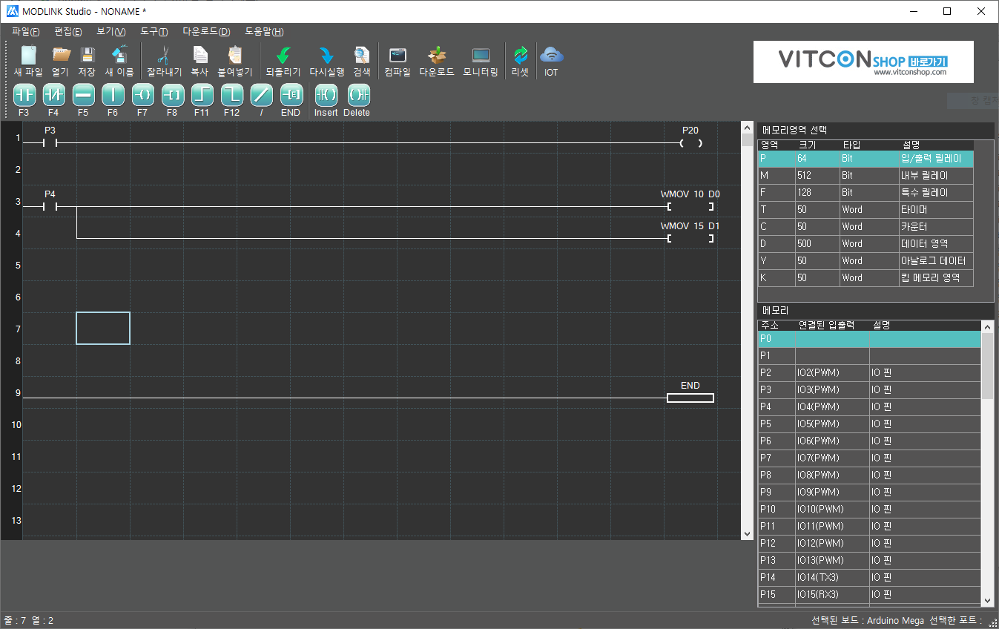

# ModlinkStudio

ModlinkStudio는 래더 언어를 사용하여 Modlink에 펌웨어를 올릴 수 있는 개발 툴이다.

## 특징
+ PLC사용자에게 친숙하도록 에디터에서 Ardunio C코드를 배제하고 래더 언어를 사용.
+ Vitcon IoT 서비스나 VDOS에 연동이 가능하도록 UI를 지원.
+ Modlink 외에도 Arduino Uno, Mega 기반 보드에서 사용 가능함.

## 개발 언어 및 빌드 환경
+ Visual Studio 2017
+ .Net Framework 4.5
+ C# WinForm

## 상세 정보
+ [Vitconshop 자료실](https://vitconshop.com/board/?id=modlinkstudio)
