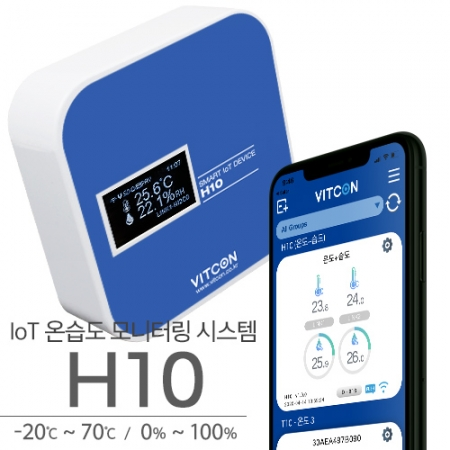

# H10

  

H10 온습도 모니터링 디바이스

## 기능
  + 무선 WiFi로 인터넷 접속
  + BLE를 사용하여 Wifi 접속 설정 및 기기 등록(스마트폰 사용)
  + 실시간 온습도 모니터링
  + 제품에서 최대100m 거리까지 센서 설치 가능
  + [V-OLA](https://v-ola.com)서버에서 현재상태확인, 과거데이터조회, 통계 확인 가능
  + 스마트폰 App을 통해 실시간 온습도 확인 및 Push로 알람 가능
  
## 개발 환경
  + [Arduino Sketch IDE v1.8.9](https://www.arduino.cc/en/Main/Software)
  + [Arduino core for ESP32 v1.0.4](https://github.com/espressif/arduino-esp32)
  
## 상세정보
 + [Vitcon](http://vitcon.co.kr/default/product/t10.php)
 + [VitconShop](https://www.vitconshop.com/goods/catalog?code=00080014)
