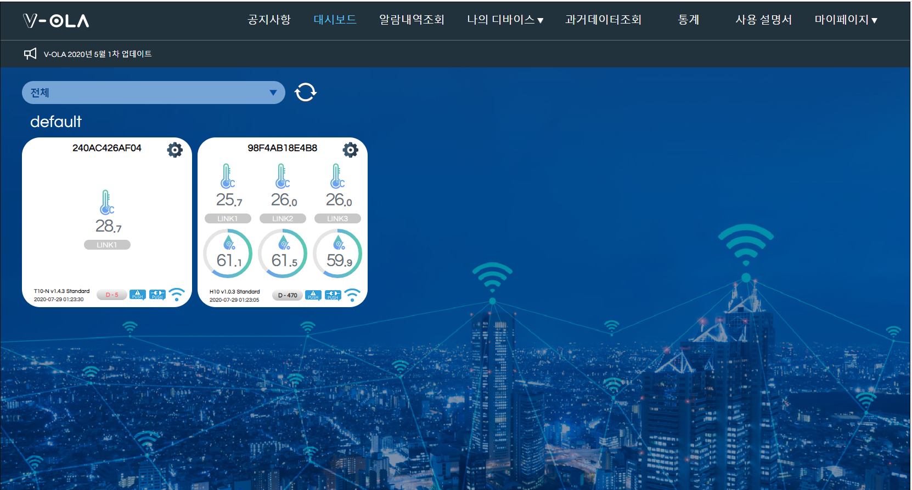

VOLA서비스는 Vitcon사의 서비스로 자사 제품을 온라인으로 서비스 하기 위해 기획한 시스템으로 2019년부터 정식 서비스 중이다.
주로 온도/습도 모니터링 위주의 서비스를 제공하며 과거데이터 조회, 알람내역확인, 스마트폰 실시간 알람 등의 기능을 제공한다.

+ **개발 기간**: 약 1년
+ **투입 인력**: 고급개발자 2명(백엔드, 펌웨어), 초급개발자 1명(프론트엔드), 외주업체 1군데

# 주요 기능
+ 제품 모니터링용 대시보드 제공
+ 과거 데이터 확인
+ 통계 확인
+ 알람내역 확인
+ 온습도 알람 범위 지정 및 범위 이탈시 푸시 알람
+ 사용자 관리(하위 사용자 추가)

# 관련 제품
+ [T10](./T10.md)
+ [H10](./H10.md)

# 기타
+ [V-OLA사이트 링크](https://v-ola.co.kr/)
